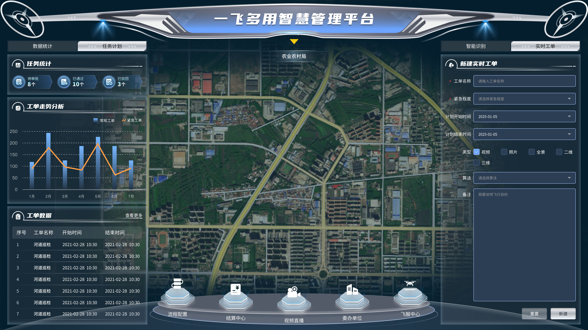
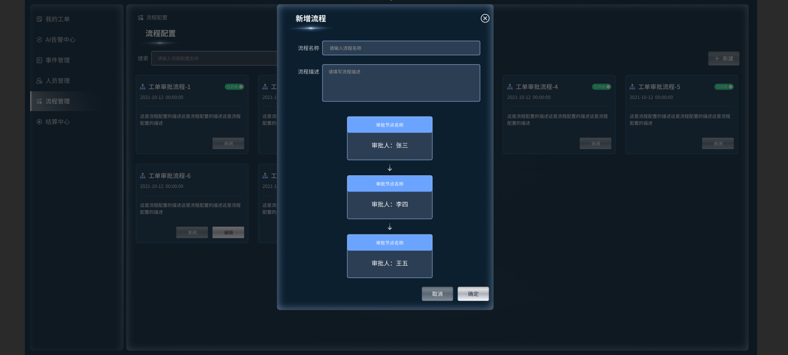
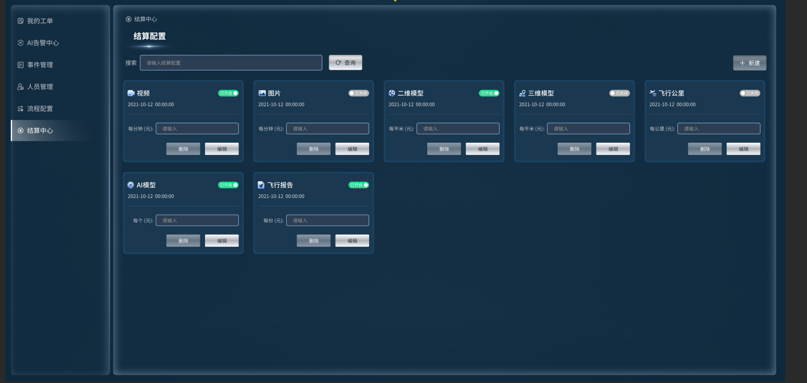

English | [中文](./README.md)

# Unified One-Net Low-Altitude Management - UAV Inspection System
## Project Introduction
Unified One-Net Low-Altitude Management - UAV Inspection System is an integrated low-altitude government governance platform. Powered by UAV nest hardware and deep software-hardware collaboration, it builds a full closed-loop system for low-altitude inspection covering airspace, routes, equipment, missions, data, and operation & maintenance. It realizes unified management and flight control via a **single integrated network** across multiple industries and scenarios, completely innovating the traditional government inspection model.

## Technical Features

- 🔒 **Secure & Compliant Deployment**: Dual deployment on edge nodes and domestic servers, with localized data processing, ensuring security, compliance and fast response.
- ⚡ **Rapid Emergency Response**: Hundred-meter-level fast response to emergency instructions, stably performing inspection tasks in extreme weather and nighttime environments.
- 🧠 **AI-Driven Efficiency**: Self-developed AI intelligent analysis algorithms + fully automatic route planning, covering multiple inspection targets in a single route, greatly improving inspection efficiency.
- 🚀 **7×24 Unattended Operation**: Deeply adapted to various UAV nests, supporting unmanned automatic takeoff/landing, battery swap/charging, and uninterrupted full-time operation.

## Mature Application Scenarios
| Application Scenario | Core Capabilities |
|----------------------|-------------------|
| Farmland Protection | Real-time identification of illegal construction and occupation, precise annotation, trajectory tracking |
| Ecological & Environmental Protection | Sewage outlet monitoring, water quality anomaly identification, pollution source location |
| Forest Fire Prevention | Intelligent forest fire and smoke identification, high-temperature point early warning, fire location |
| Water Area Control | Illegal vessel intrusion early warning, river channel illegal construction/floating debris identification |
| Urban Governance | Illegal vehicle parking capture, roadside operation identification, municipal facility inspection |

## Core Functional Modules
1. **🛣️ Airspace Management**: Overall planning of airspace resources, streamlined flight approval, precise definition of no-fly/restricted zones, visual airspace situation on a single map.
2. **✈️ Route Management**: Visual drag-and-drop route design, batch route import/export, intelligent obstacle avoidance planning, templated inspection task configuration, historical route reuse and optimization.
3. **📡 Equipment Management**: Real-time monitoring of UAV/nest status, visual online status display, remote control and parameter adjustment, automatic fault alarm and location, full-life-cycle operation and maintenance logs.
4. **🤖 AI Intelligent Recognition**: One-click loading of multi-scenario algorithm models, automatic target recognition, classification, location and capture, structured output of results, no manual video review required, efficiency increased by over 80%.
5. **📝 Work Order Management**: Second-level automatic alarm for abnormal events, automatic work order generation and intelligent dispatch, full-process disposal tracking, traceable records throughout the cycle.
6. **👥 Personnel Management**: Hierarchical account authority control, custom role configuration, full operation log audit, intelligent scheduling for inspectors, automatic performance statistics.
7. **🚨 Emergency Command**: Rapid issuance of emergency tasks, real-time on-site video feedback, multi-party collaborative command, historical task review and analysis.
8. **💰 Recharge & Billing Management**: Multi-dimensional billing based on flight duration, route count and inspection area, online recharge and bill inquiry, automatic statistics and reconciliation, visual billing data analysis.

## Solution Capabilities
- 🎯 **Full-Stack Solution**: End-to-end services including nest hardware adaptation, self-developed AI algorithms, platform function development and business process integration.
- 🔗 **Seamless Integration**: Quick connection with existing government systems such as smart city, unified governance and grassroots management platforms.
- 💰 **Cost Reduction & Efficiency Improvement**: Reduce project implementation cost by over 30% and shorten delivery cycle by over 50%.
- 📈 **Scenario Adaptation**: Easily adapted to various low-altitude inspection and government application scenarios for fast implementation.

## System Interface Screenshots

## Contact Us
- Business Consultation: WeChat: xiaoyuner1349
- Technical Support (Email): xingyue131@2925.com

